<!-- cSpell:disable -->

 

<table>
<tr>
<td valign="top"></td>
<td valign="top"></td>
</tr>
</table>

### About Me

Flutter Developer with 1+ year shipping production apps, a **Top 7 finish among 900+ hackathon participants**, and **600+ DSA problems** solved across LeetCode, Codeforces, GeeksforGeeks and CodeChef. Comfortable across state management (Provider, BLoC), on-device AI inference with TensorFlow Lite, and JWT-secured REST APIs on Node.js / Spring Boot backends. Currently open to **Flutter Developer**, **Full Stack**, and **SDE-1** roles on product teams shipping mobile-first software.

<!-- animated contribution graph, refreshed daily by the workflow -->

### Tech Stack

**Mobile**

**Languages**

**Frontend**

**Backend**

**Database**

**Cloud & DevOps**

**Tools**

### Competitive Programming

600+ DSA problems solved across LeetCode, Codeforces, GeeksforGeeks & CodeChef · LeetCode Top SQL 50 badge · HackerRank SQL Certified (Basic & Intermediate)

  

  
  

### Featured Projects

<table>
<tr>
<td width="50%" valign="top">

**SafePulse — Edge-AI Travel Safety App** 
`Flutter` `Node.js` `MongoDB` `TensorFlow Lite` `Firebase`

Offline-first crash detection via on-device TFLite inference on accelerometer/gyroscope, live journey tracking, and automated SOS workflows. Cut emergency response initiation time ~40% vs. manual dialling. **Top 7 finalist, 900+ participants.**

[github](https://github.com/Bhagyaprasad92/safepulse)

</td>
<td width="50%" valign="top">

**NLtoSQL — Natural Language to SQL Engine** 
`Flutter` `Spring Boot` `Gemini 2.5 Flash` `MySQL`

3-tier microservice that turns plain-English questions into executable MySQL queries via prompt engineering, letting non-technical users query a 10k-row database with zero SQL knowledge. 95% test coverage.

[github](https://github.com/Bhagyaprasad92/NLtoSQL_System)

</td>
</tr>
</table>

### Certifications

  
  
  
  
  

### GitHub Stats & Achievements

 

<table>
  <tr>
    <td valign="top">
      
    </td>
    <td valign="top">
      
    </td>
  </tr>
</table>

### 📖 Profile Guestbook

<!-- GUESTBOOK-START -->
<ul style="list-style: none;">
  <li> <b><a href="https://github.com/koduruannarao">@koduruannarao</a></b>: <i>"Good work!"</i></li>
  <li> <b><a href="https://github.com/Bhagyaprasad92">@Bhagyaprasad92</a></b>: <i>"Welcome to Guestbook"</i></li>
</ul>
<!-- GUESTBOOK-END -->

 

**"Code. Learn. Build. Repeat."**

  &copy; 2026 Bhagya Prasad Dannina. All Rights Reserved. 
  <i>This profile's design, code, and automated workflows are proprietary. Copying or using this repository as a template is strictly prohibited.</i>

